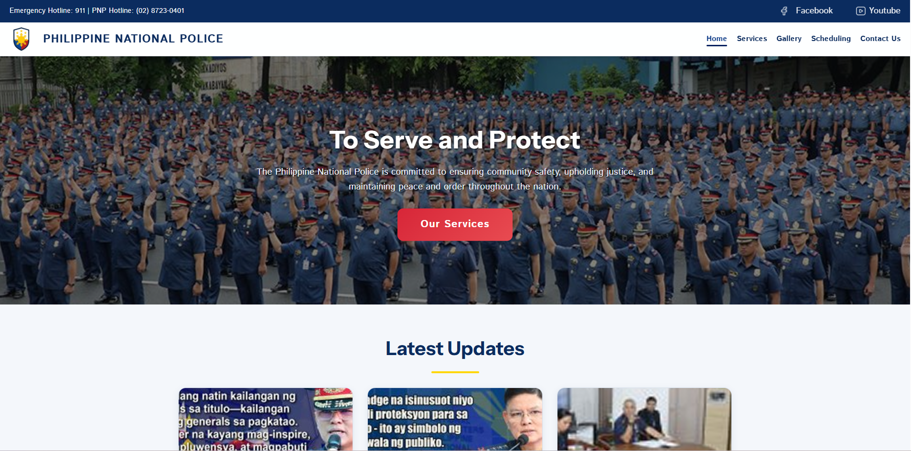

# Philippine National Police Website Redesign

A modernized front-end redesign for a multi-page Philippine National Police information website, focused on visual consistency, usability, accessibility, and responsive behavior across desktop, tablet, and mobile devices.

## Project Overview

This update introduces a shared UI system that standardizes colors, typography, spacing, and component styling across all pages:

- `homepage.html`
- `services.html`
- `gallery.html`
- `scheduling.html`
- `contact.html`

The redesign is applied through a centralized stylesheet, `theme.css`, loaded after each page-specific stylesheet so existing layouts remain intact while receiving a consistent visual upgrade.

## UI/UX Design Decisions

### 1) Color Palette (HEX)

- Primary: `#0B2C5F`
- Secondary: `#123F8A`
- Accent: `#D72638`
- Background: `#F4F7FB`
- Surface/Card: `#FFFFFF`
- Main Text: `#10243F`
- Muted Text: `#5F6F86`
- Border/Divider: `#D8E0EC`

These values are defined as CSS custom properties in `theme.css` to keep colors uniform site-wide.

### 2) Typography System

- Headings: `"Poppins", "Instrument Sans", Arial, sans-serif`
- Body/UI text: `"Inter", "Istok Web", Arial, sans-serif`
- Intended hierarchy:
  - `h1`: major page hero title
  - `h2`: section title
  - `h3`: card/title level
  - body text: readable and neutral, optimized for long descriptions

### 3) Layout & Component Consistency

- Cards/forms use consistent radius, borders, and soft elevation shadows
- Buttons use a single accent treatment with shared hover behavior
- Section containers maintain predictable horizontal padding
- Links use the secondary brand color and accent hover feedback
- Footer and resource section match the same visual language as the rest of the site

## Responsive Design Approach

The redesign follows a mobile-aware, breakpoint-based strategy:

- Desktop: full multi-column layouts and wider content containers
- Tablet (`<= 900px`): simplified spacing and stacked content where needed
- Mobile (`<= 600px`): tighter spacing, smaller typography, and one-column priority

Core improvements:

- Better mobile readability in hero and content blocks
- More consistent component spacing at small screen widths
- Preserved usability for card-heavy sections and forms on narrow devices

## File Changes

- Added: `theme.css` (shared design system and overrides)
- Updated: `homepage.html` (theme include + malformed anchor fix)
- Updated: `services.html` (theme include)
- Updated: `gallery.html` (theme include)
- Updated: `contact.html` (theme include)
- Updated: `scheduling.html` (theme include)

## Installation / Setup

1. Clone or download this project.
2. Keep all HTML/CSS/image/icon files in the same relative structure.
3. Open `homepage.html` in your browser.
4. Navigate through pages via the top navigation.

No build tools are required for local preview (static HTML/CSS/JS project).

## Technologies Used

- HTML5
- CSS3 (custom properties, responsive media queries, modern UI patterns)
- Vanilla JavaScript (existing page interactions)

## Screenshots / Preview

You can add screenshots in a folder like `screenshots/` and reference them here:

```md


```

## Sample Reusable Component Structure

### HTML

```html
<article class="service-card">
  <h3>Service Title</h3>
  <p>Short, clear description of the service.</p>
  <a class="service-link" href="#">Learn more</a>
</article>
```

### CSS Pattern

```css
.service-card {
  background: var(--color-surface);
  border: 1px solid var(--color-border);
  border-radius: var(--radius-lg);
  box-shadow: var(--shadow-sm);
  padding: var(--space-lg);
}
```

## Responsive Behavior Summary

- Grid/card sections reduce columns as viewport shrinks
- Section spacing adapts via clamp and breakpoint overrides
- Typography scales for readability in hero and body text
- Navigation remains touch-friendly on small devices

---

If you continue iterating, keep new styles inside `theme.css` first and only use page CSS for page-unique layout behavior. This keeps the UI system maintainable and consistent.
